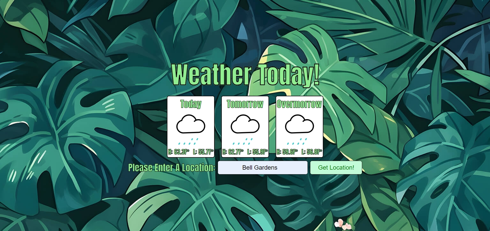

# Installation
> Note
>
> > [A live deployment of Weather Today is available on GitHub pages](https://jaime-sanz.github.io/Weather-Today/)

For those who would like to run the application and/or edit its source code on their local computer, follow the steps below:

1. Clone the repository with `git clone https://github.com/Jaime-Sanz/Weahter-Today` or download it as a .zip file and extract it.
2. Navigate to where the repository is saved on your local machine and open its index.html file on your preferred web browser.

# Usage
- Provides current weather information based on user input location.
- Displays a 3-day weather forecast for the selected location.
- Offers a user-friendly interface for easy navigation and interaction.

# Preview

| Weather Searched |
| --- |
|  |

# Built Using
> 

# Contributing
Feel free to submit an issue should a bug be found using the application.
# License
[MIT License](https://github.com/Jaime-Sanz/Weather-Today/blob/main/LICENSE)
# Contact Info
> Send a message by clicking on the icon!
> 
> 
